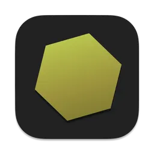

<div align="center">



# NectarView

**The Next Gen Manga Viewer for macOS**

A fast, native comic and manga viewer inspired by [HoneyView](https://en.bandisoft.com/honeyview/).
Open archives directly, enjoy smooth page turning, and immerse yourself in reading.

[](https://apps.apple.com/app/nectarview/id6753213525)

[](https://github.com/kumamotone/NectarView/releases)
[](LICENSE)
[](https://apps.apple.com/app/nectarview/id6753213525)

[Website](https://kumamotone.github.io/NectarView/) · [Download](https://apps.apple.com/app/nectarview/id6753213525) · [Releases](https://github.com/kumamotone/NectarView/releases)

</div>

---

## Demo

[](https://www.youtube.com/watch?v=mFOk0N7pozo)

> Click the image above to watch the demo on YouTube.

---

## Features

### Intuitive Operation
- Drag & drop to open files instantly
- Double-click to toggle fullscreen
- Open from context menu ("Open with NectarView")
- Drag the image area to move the window

### Flexible Display Options
- Switch between single page and spread (two-page) view
- Support for left-to-right and right-to-left reading
- Quick image switching with slider & thumbnail preview
- Realistic book appearance mode with 3D page effect

### High-Speed Performance
- Open ZIP, RAR, 7z, and other archives directly without extraction
- Fast image display with background prefetching
- Efficient processing using native macOS APIs
- Password-protected archive support

### User-Friendly Interface
- Clean, non-intrusive HUD-style controls that auto-hide
- Customizable background and control bar colors
- Full keyboard shortcut support
- English and Japanese interface with auto-detection

### Advanced Features
- 12 real-time image filters (Sepia, Mono, Noir, and more)
- Bookmark pages and navigate between them
- Auto page turn with adjustable interval (0.5–30 seconds)
- Zoom up to 5x with pinch-to-zoom and pan
- Image rotation (90° CW/CCW)
- Resizable sidebar with image list

---

## Supported Formats

| Type | Formats |
|------|---------|
| **Images** | PNG, JPEG, GIF, BMP, TIFF, WebP |
| **Archives** | ZIP, RAR, 7z, TAR, GZ, BZ2, XZ, LHA/LZH, CAB, SIT/SITX |
| **Documents** | PDF |

---

## Installation

### Mac App Store (Recommended)

[](https://apps.apple.com/app/nectarview/id6753213525)

### Manual Install

1. Download `NectarView.dmg` from the [latest release](https://github.com/kumamotone/NectarView/releases).
2. Mount the DMG and drag NectarView.app to your Applications folder.

---

## Keyboard Shortcuts

| Action | Shortcut |
|--------|----------|
| Open File | `⌘O` |
| Single Page View | `⌘1` |
| Spread View (R→L) | `⌘2` |
| Spread View (L→R) | `⌘3` |
| Toggle Fullscreen | `⌘⌃F` |
| Zoom In / Out / Reset | `⌘+` / `⌘-` / `⌘0` |
| Rotate CW / CCW | `⌘R` / `⌘L` |
| Bookmark | `⌘B` |
| Next / Prev Bookmark | `⌘]` / `⌘[` |
| Settings | `⌘,` |

---

## Building from Source

Requires **Xcode 15+** and **macOS 14.0+**.

```bash
git clone https://github.com/kumamotone/NectarView.git
cd NectarView
open NectarView.xcodeproj
```

Build and run with `⌘R` in Xcode.

### Dependencies (via Swift Package Manager)
- [ZIPFoundation](https://github.com/weichsel/ZIPFoundation) — ZIP archive reading
- [XADMaster (Swift)](https://github.com/kumamotone/XADMaster-Swift) — RAR, 7z, and other archive formats

---

## Links

- [Website](https://kumamotone.github.io/NectarView/)
- [Mac App Store](https://apps.apple.com/app/nectarview/id6753213525)
- [Privacy Policy](https://kumamotone.github.io/NectarView/privacy-policy.html)
- [Contact](https://kumamotone.github.io/NectarView/contact.html)

---

## License

This project is open source. See the [LICENSE](LICENSE) file for details.
